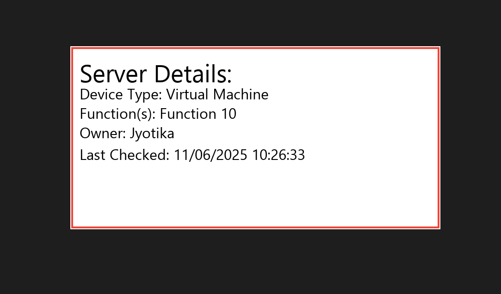

# Real-TimeMonitoringDashboard
Monitoring Dashboard for Assets using Python, tkinter and aioping with real-time graphs.

Features

- **Dynamic Auto-Pinging**: Asynchronous pinging using `aioping` for near real-time server status updates.
- **Custom Notifications**: Beautiful Tkinter-based popup alerts for unresponsive/delayed/active servers.
- **Category Classification**:
  - 🟢 Active (≤200ms)
  - 🟠 Delayed (>200ms)
  - 🔴 Unresponsive
- **Dashboard Animations**: Flip cards on click with detailed back views and visual effects.
- **Auto-Refresh Cycle**: Periodically updates the displayed server cards.
- **Graph Analytics**: View server-wise ping performance over time via interactive matplotlib plots.
- **Interactive UI**: Search, sort, enlarge cards, select columns to display - fully customizable.
- **Excel Integration**: Load data from an Excel file and dynamically choose columns for monitoring.

Technologies Used

- **Python 3.x**
- `Tkinter` – GUI Framework
- `aioping` – Async ICMP ping
- `openpyxl` – Excel integration
- `matplotlib` – Plotting analytics
- `Pillow (PIL)` – Image processing
- `winotify` – Optional Windows toast notifications

How to Run

1. **Clone the repository**:
   ```bash
   git clone https://github.com/JyotikaGarg1208/Real-TimeMonitoringDashboard.git
   cd Real-TimeMonitoringDashboard

2. **Install Dependencies**:
   pip install -r requirements.txt

3. **Run the Dashboard**:
   python dashboard.py

Input Excel File
Prepare your Excel file with a structure like:

Server Name	IP Address	Dashboard	Location	Owner	Function
  Server1	192.168.1.1	   Yes	      UK	    Admin	  DNS

On startup, you'll be prompted to select:
1. Type of Device
2. File Name
3. Header row number
4. Columns for Server Name, IP Address, and Dashboard
5. 3 optional columns to display on card flip

UI Preview





Customization
Ping Interval Slider: Adjust between 5–60 seconds.
Auto-Refresh: Toggle on/off for auto cycling.
Sorting: Sort by Server Name or Response Time.
Search: Instantly locate a server by name/IP.

Author
Developed with ❤️ by Jyotika Garg